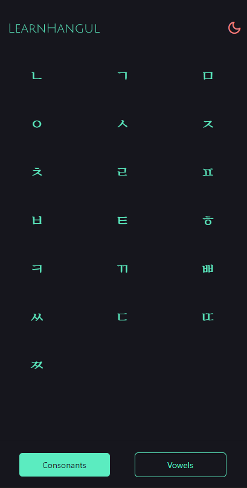

# LearnHangul (In progress..)

An easy-to-use app designed for learning the Korean alphabet, also known as Hangul.

### Built with

- [React Native](https://reactnative.dev/)
- [Expo](https://expo.dev/)
- [Styled Components](https://styled-components.com/)
- [React Navigation](https://reactnavigation.org/)

### To do:

- randomize the alphabet
- add ability to save changes
- ...

### Author

- [Jech](https://jerecho.com/)

## Screenshots

	
View screenshots

  

